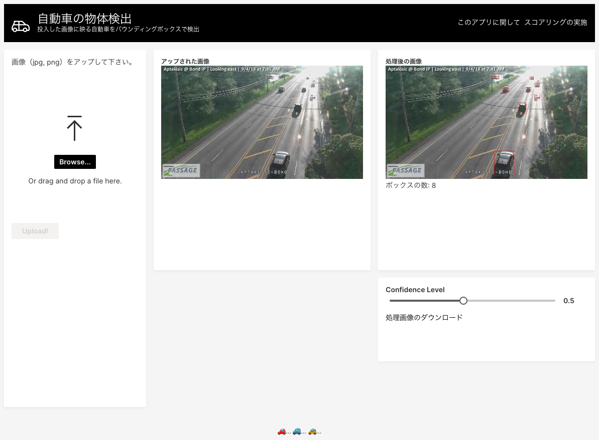

# Object_Detection_Scoring_App

画像内の自動車の検知を実施  

---
[./notebooks/Scoring.ipynb](./notebooks/Scoring.ipynb) : MLOps上へのスコアリングAPIへのリクエストの実施例

---
[./app/prod/](./app/prod/) : アプリのプログラム  
[./app/tutorials/](./app/tutorials/) : アプリ作成の参考プログラム

(Document)[H2O Wave](https://wave.h2o.ai/)

---
[./H2OAppStore/](./H2OAppStore/) : H2O AI Cloudへのアップロードファイル一式  

(Document)[App Store - App Depeloper Guide](https://h2oai.github.io/h2o-ai-cloud/developerguide)  
(Blog)[Setting Up Your Local Machine for H2O AI Cloud Wave App Development](https://h2o.ai/blog/setting-up-your-local-machine-for-h2o-ai-cloud-wave-app-development/)

---
その他Document
- [H2O Hydrogen Torch](https://docs.h2o.ai/h2o-hydrogen-torch/get-started/what-is-h2o-hydrogen-torch)
- [H2O MLOps](https://docs.h2o.ai/mlops/)
